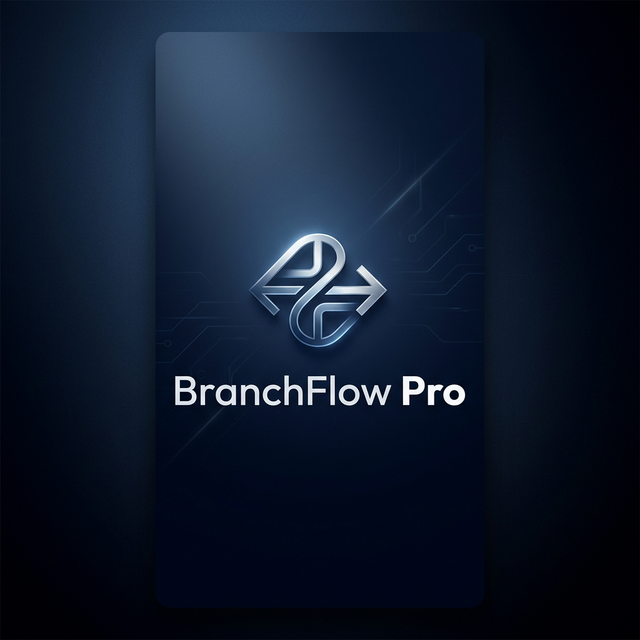

<div align="center">
  
  <h1>🚀 BranchFlow Pro</h1>
  <p><strong>Next-Gen Enterprise Logistics & Branch Synchronization Ecosystem</strong></p>

  [](https://reactnative.dev/)
  [](https://expo.dev/)
  [](https://nodejs.org/)
  [](https://www.mongodb.com/)
</div>

---

## 📱 Project Ecosystem

BranchFlow Pro is a multi-platform solution designed for logistics companies to manage shipments, track branch performance, and synchronize staff operations in real-time.

| Module | Description | Platform |
| :--- | :--- | :--- |
| **📦 Staff App** | Dispatch creation, tracking, and receipt management. | Mobile (iOS/Android) |
| **👑 Admin App** | Network oversight, branch keys, and advanced analytics. | Mobile (iOS/Android) |
| **💻 Admin Panel** | Web-based system configuration and company setup. | Web (Vite/React) |
| **⚙️ Backend** | RESTful API with secure auth and real-time MongoDB syncing. | Node.js / Express |

---

## ✨ Key Features

- **🚀 Instant Caching**: Heavy use of `AsyncStorage` for an offline-first experience. Data loads instantly from cache while refreshes happen in the background.
- **🛡️ Secure Network**: Role-based access control (Admin/Staff) ensures data integrity across the logistics chain.
- **📊 Live Analytics**: Dynamic dashboards for both staff and administrators providing real-time insights into transit performance.
- **🎨 Premium UX**: Sleek, glassmorphic dark-mode design with translucent status bars and responsive navigation.
- **📥 One-Tap Receipt**: Simplified QR-ready dispatch acknowledgment system.

---

## 🎨 Brand Assets

<div align="center">
  
  <br />
  <em>The official BranchFlow Pro Splash Experience</em>
</div>

---

## 🛠️ Technical Stack

- **Frontend core**: React Native with Expo SDK.
- **Navigation**: React Navigation (Stack & Tabs) with Native-Stack performance.
- **State Management**: Context API with persistence hooks.
- **Architecture**: Micro-controller pattern on the backend for clean separation of concerns.
- **Database**: MongoDB with Mongoose ODM for flexible schema modeling.

---

## 🚀 Getting Started

### 1. Backend Setup
```bash
cd backend
npm install
npm start
```

### 2. Mobile Apps (Staff & Admin)
```bash
# For Staff App
cd frontend
npm install
npx expo start

# For Admin App
cd admin-app
npm install
npx expo start
```

### 3. Web Admin Panel
```bash
cd adminpanel
npm install
npm run dev
```

---

<div align="center">
  <p>Built with ❤️ by the BranchFlow team.</p>
</div>
